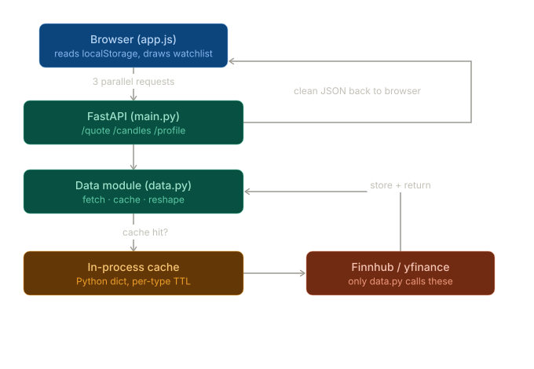

# finance-fun

A public (no-login) finance site. Compare stocks, read finance news, track favorite
tickers with a price chart, and browse a curated prompt library.

See [`docs/PLAN.md`](docs/PLAN.md) for the full project plan and rationale.

---

## Current status

**v1 complete.** All six build steps are done — FastAPI + full data layer + the whole
frontend (watchlist with chart, compare view, news view, prompt library).

### Build order

- [x] Step 1 — FastAPI skeleton, Render deploy pipeline
- [x] Step 2 — Data module + `/quote/{symbol}` (Finnhub, cache)
- [x] Step 3 — Remaining endpoints: candles (yfinance), fundamentals, profile, news
- [x] Step 4 — Frontend shell, watchlist (localStorage, capped at 10 tickers), 90-day
      TradingView chart
- [x] Step 5 — Compare view (`compare.html`/`compare.js`: two-ticker side-by-side
      framework table, `?a=&b=` deep links) and news view (`news.html`/`news.js`:
      ticker search + watchlist quick-chips, article list)
- [x] Step 6 — Prompt library (`static/prompts.json` served as a static asset;
      `prompts.html`/`prompts.js`: category-filter chips + copy-to-clipboard cards)

---

## Stack

| Layer | Choice |
|---|---|
| Frontend | Vanilla HTML / CSS / JS |
| Charts | TradingView Lightweight Charts |
| Backend | Python + FastAPI |
| Hosting | Render (free tier) |
| Data | Finnhub free tier (quotes, news, fundamentals) + yfinance (candles, 24h cache) |
| Rate limiting | slowapi — candles 20/min, other data endpoints 60/min (per IP) |
| Favorites | Browser localStorage |
| Prompt library | Static JSON in repo |

---

## Data flow



---

## Local development

```powershell
# First time only
python -m venv .venv
.\.venv\Scripts\pip install -r requirements.txt

# Add your Finnhub key (never commit this file)
# Create .env in the repo root:
#   FINNHUB_API_KEY=your_key_here

# Start the dev server
.\.venv\Scripts\uvicorn main:app --reload
```

Then open `http://127.0.0.1:8000` — the watchlist + chart frontend loads directly.
Other pages: `/compare.html` (two-ticker comparison), `/news.html` (ticker news
search + watchlist quick-chips), `/prompts.html` (prompt library, copy-to-clipboard);
all linked from the header nav.

API endpoints: `/quote/AAPL`, `/candles/AAPL?days=30`, `/fundamentals/AAPL`,
`/profile/AAPL`, `/news/AAPL`. Health check: `/health`.

**VS Code:** select `.venv/Scripts/python.exe` as the Python interpreter
(`Ctrl+Shift+P → Python: Select Interpreter`).

---

## Render deployment

1. Push to GitHub.
2. In [Render](https://render.com) → **New → Web Service** → connect your repo.
3. Set these in the Render dashboard:
   - **Build command:** `pip install -r requirements.txt`
   - **Start command:** `uvicorn main:app --host 0.0.0.0 --port $PORT`
4. Under **Environment** → add `FINNHUB_API_KEY` with your key.
5. Deploy — Render assigns a public URL automatically.

**Never commit the API key** — it must live only in Render's environment variables.

> Free-tier services spin down after ~15 min of inactivity and take ~1 min to wake on
> the next request. This is fine for a low-traffic hobby site.

---

## Docs

| File | Contents |
|---|---|
| [`docs/PROJECT_CONTEXT.md`](docs/PROJECT_CONTEXT.md) | Quick orient: build status, two-provider design, hard constraints |
| [`docs/PLAN.md`](docs/PLAN.md) | Full project plan, stack rationale, architecture |
| [`docs/DATA_MODULE.md`](docs/DATA_MODULE.md) | Data module contract: endpoints, cache TTLs, provider exceptions, output shapes |
| [`docs/PROMPT_LIBRARY.md`](docs/PROMPT_LIBRARY.md) | Prompt library contract: record shape, frontend behaviour |
| [`CLAUDE.md`](CLAUDE.md) | Operating brief for Claude Code |
